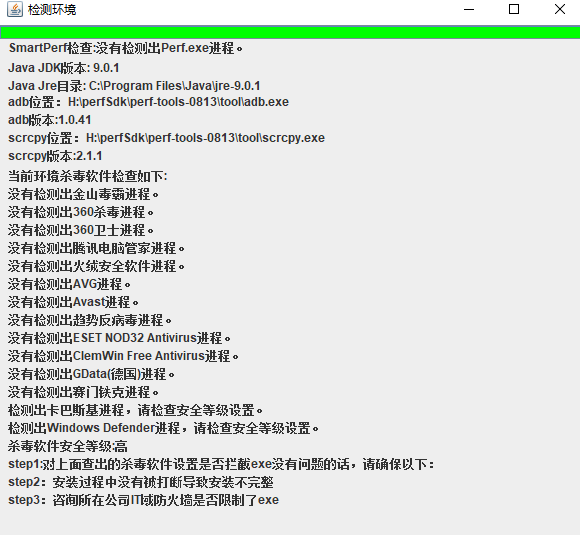

# 工具介绍
  这是一款专业的性能评测工具，致力帮助行业提供低成本高可用的性能自动化评测算法能力，帮助降低人力成本提升性能评测效率。 
 

# 全景图
 
 
# 工具示例


# 现在地址
### 小工具
- 当前版本: 1.0.4 
- 1.0.4 更新内容：简化了日志打印，添加了检查环境的功能，有JDK版本和界面用JavaFx  
- Windows和Mac共用的Jar包：[网盘链接](https://share.weiyun.com/uCkHUssk)  
  PS：链接过期可以联系交流群。  
备注：目前都使用了jar包的方式，请使用官方Jdk1.8来启动。 
启动方式
```
java -jar <这里请替换你存放的路径>/perf.jar
```
如果没有按环境启动，日志界面上面会有提示错误信息并且中断执行。

### Java Sdk
[demo链接](https://github.com/testly/perf-sdk-demo)

### Python Sdk(待更新)
[demo链接]()

# 使用说明

### 环境要求
1.确保JAVA环境安装成功并且配置环境变量。  
  注意:一定要使用Oracle(唯一官方)JDK版本1.8.x,x为小版本不关注，不要使用非官方的版本，会导致启动窗体问题。

2.ADB环境配置环境变量，在当前目录下面有adb.zip

3.确保Scrcpy安装成功，在当前目录下面有scrcpy-win64-v2.3.1.zip,Mac请自行百度。

### 自检环境(热心群众本cat贡献)

- 可以检测当前工具是否运行(判断是否后台进程没了) 
- 杀毒软件安装了哪些，是否阻止了exe运行。
- adb和scrcpy是否配置了环境变量，位置在哪里，版本号多少
- JDK版本号和位置(区分是否符合标准的)

### 使用步骤
第一步： 打开工具客户端，连接测试设备
> 也可以使用网页模式，打开浏览器输入：localhost:9420


第二步： 等待任务运行完成
> 等待 1分钟左右


第三步：查看结果，并且校验准确性
> 一般查看识别到的关键帧的前后帧是否加载结束即可


